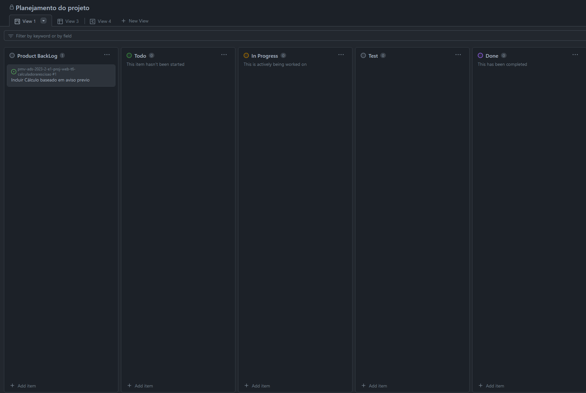
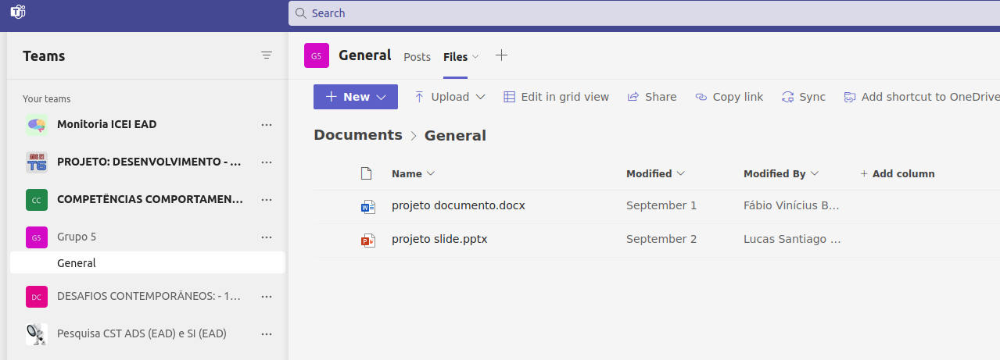
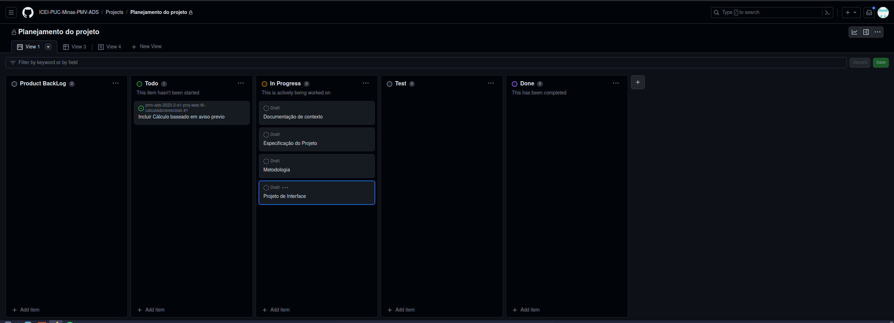
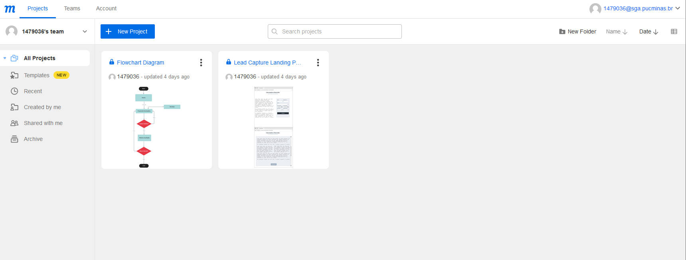
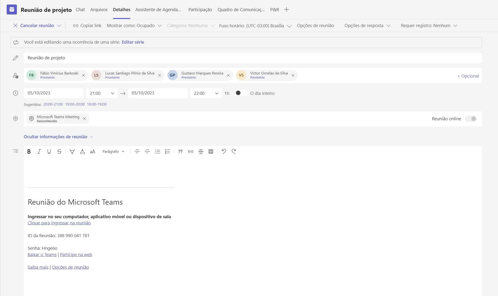
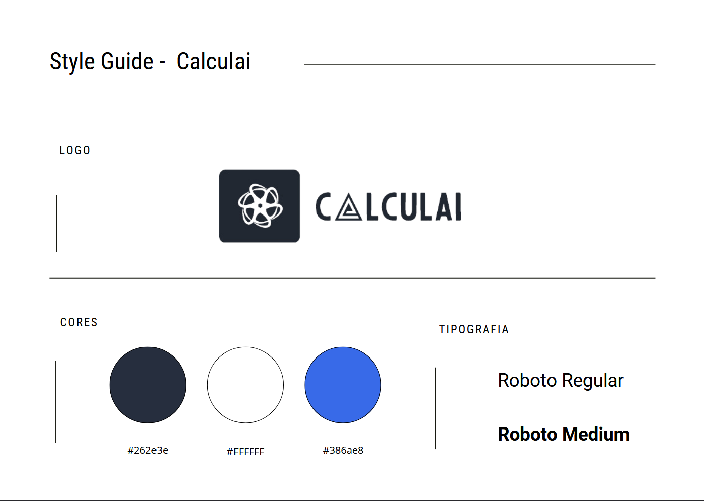

# Metodologia

## Gerenciamento de Projeto
A escolha de adotar o Scrum para o projeto se baseia na sua comprovada eficácia em promover colaboração, eficiência e controle de escopo. Dada a clareza do escopo do projeto, o Scrum se destaca como a metodologia mais apropriada. Sua habilidade em otimizar a gestão de recursos e prazos, mantendo a capacidade de resposta a mudanças inesperadas, é altamente relevante. Com suas iterações curtas, conhecidas como Sprints, e o compromisso constante em entregar valor, acreditamos que conseguiremos manter o projeto dentro do escopo estipulado, garantindo o êxito dos nossos objetivos

### Divisão de Papéis
Com base na metodologia escolhida foi definida a divisão dos papéis da seguinte forma:
- Scrum Master: Lucas Antonio Riboli
- Product Owner: Victor Ornelas da Silva
- Equipe de Desenvolvimento: **Fabio Vinícius Barkoski**, Gustavo Marques, Lucas Antonio Riboli, Lucas Santiago Plínio da Silva, Victor Ornelas da Silva
- Equipe de Design: Fabio Vinícius Barkoski, **Gustavo Marques**, Lucas Antonio Riboli, Lucas Santiago Plínio da Silva, Victor Ornelas da Silva
- Equipe de Testes: Fabio Vinícius Barkoski, Gustavo Marques, Lucas Antonio Riboli, **Lucas Santiago Plínio da Silva**, Victor Ornelas da Silva

### Processo
Como equipe optamos pelo GitHub Project para organizar nossas atividades de desenvolvimento de forma eficiente. Com ele teremos uma ótima maneira de distribuir tarefas e gerenciar sprints, deixando o processo transparente, colaborativo e eficaz. Para alcançar esses pontos, estruturamos o projeto da seguinte forma:

- Backlog: Recebe as tarefas a serem trabalhadas e representa o Product Backlog. Todas as atividades identificadas no decorrer do projeto também devem ser incorporadas a esta lista. 
- To Do: Esta coluna representa o Sprint Backlog. Este é o Sprint atual que estamos trabalhando.
- Doing: Quando uma tarefa tiver sido iniciada, ela é movida para cá.
- Test: Nesta coluna a tarefa passará por testes que vão validar o que foi feito e a integridade da aplicação.
- Done: Nesta coluna são colocadas as tarefas que passaram pelos testes e controle de qualidade e estão prontas para ser entregues ao usuário.

|Imagem|Descrição|
|------|---------|
| | Imagem do quadro Kanban.|

#### Product Backlog
Valores a serem entregues no projetos:
- Documentação de Contexto
- Especificação do Projeto
- Metodologia
- Projeto de Interface
- Template da aplicação
- Programação de Funcionalidades
- Plano de Testes de Software
- Registro de Testes de Software
- Hospedagem da Solução
- Apresentação do Projeto
- Vídeo de demonstração da solução

#### Sprint 1
##### Planejamento
Para esta sprint, o objetivo é criar a Especificação do Projeto e a Documentação de Contexto, além de ter um esboço de apresentação do projeto, utilizando apenas o Word e o PowerPoint no Teams.
##### Execução
Separamos o grupo com base em cada um dos objetivos da sprint, no qual, ao final, ficou assim: Fábio e Lucas Riboli para realizar a Especificação do Projeto; Victor e Lucas Silva para realizarem a Documentação de Contexto; e Gustavo para criar o esboço da apresentação. Após a criação do esboço, trabalhamos na formatação da apresentação para deixá-la mais apresentável e bem formatada.
##### Evidências
Criado todos os documentos planejados para a sprint, todos eles se localizam no teams do grupo.
|Imagem|Descrição|
|------|---------|
|| Captura de tela dos documentos no Teams. |

#### Sprint 2
##### Planejamento
O planejamento para este sprint foi prosseguir com o projeto utilizando como referência as entregas da etapa. Em outras palavras, consistia em redigir um documento de Metodologia contendo informações sobre o gerenciamento do projeto, a divisão de papéis e os processos. Além da metodologia, a etapa demandava a criação de um projeto de interface, incluindo o fluxo de uso e o esboço das telas.

##### Execução
No início, o grupo definiu os papéis dos membros, infelizmente, a partir disso, não houve um grande planejamento e houve má distribuição de tarefas, justificável por problemas de saúde e mudança de residência de dois integrantes da equipe. No final, Fábio e Lucas acabaram desempenhando um papel maior durante este sprint, escrevendo a metodologia diretamente no GitHub e criando o projeto de interface com a ferramenta [Moqup](https://moqups.com/). 

##### Evidências
Ao final da sprint, percebemos que será necessário um melhor planejamento e organização da equipe. No entanto, todas as tarefas foram concluídas, incluindo as relacionadas ao wireframe e fluxo que foram elaboradas com a ferramenta Moqup.
Com a ideia de aprimorar nosso planejamento, criamos também uma reunião semanal para atualizarmos uns aos outros sobre o que está sendo realizado.
|Imagem|Descrição|
|------|---------|
|| Captura de tela do Kanban do projeto. |
|| Captura de tela do wireframe feito no [Moqup](https://moqups.com/). |
| | Captura de tela mostrando a reunião semanal criada no Teams

#### Sprint 3
##### Planejamento
O planejamento para este sprint foi prosseguir com o projeto utilizando como referência as entregas da etapa. Basicamente buscamos codifica o que foi apresentado na sprint passada, ou seja, aplicar o que foi pensado para o template além de tentar criar um estilo para o projeto que se destacasse do que já existe, com um identidade visual diferente.
Planejamos também iniciar e algumas funcionalidades de nossa aplicação, para que assim seja possivel já iniciar os primeiros fluxos do site.

##### Execução
Observando nossa dificuldade em gerenciar o tempo e as ações relacionadas ao projeto, na sprint passada implementamos uma agenda semanal que engloba todos os membros. O objetivo é discutir o progresso da semana anterior e planejar as atividades das próximas semanas. Além disso, intensificamos a comunicação através do WhatsApp.

Acontecimentos em cada uma de nossas reuniões:

5 de outubro - Durante nossa primeira reunião recorrente, estabelecemos diretrizes para aprimorar a concepção de nosso projeto. Iniciamos uma discussão aprofundada sobre o design de nosso site.

12 de outubro - Devido ao feriado nesse dia, não realizamos a reunião. No entanto, através do WhatsApp, decidimos prosseguir com o desenvolvimento do site.

19 de outubro - Nesta reunião, além de realizarmos uma revisão sobre a utilização de JavaScript e CSS, abordamos questões relacionadas à gestão do tempo e do trabalho. Definimos estratégias para direcionar nossos esforços na construção do site. Além disso, Gustavo, com sua experiência em Recursos Humanos, trouxe uma nova perspectiva sobre cálculos em colaboração com seus colegas.

26 de outubro - Discutimos como organizar os cálculos e como apresentá-los. Abordamos possíveis alterações na interface e Victor compartilhou sua visão abrangente sobre o escopo dos cálculos.

Entre as reuniões, Fabio e Lucas Riboli se concentraram principalmente no desenvolvimento do front-end, trabalhando com HTML e CSS, e contribuindo na revisão de solicitações de pull requests, bem como no aprimoramento do entendimento dos cálculos por meio de JavaScript e lógica. 

##### Evidências
Ao final dessa sprint notamos que conseguimos conrrigir alguns problemas da sprint anterior, porém ainda sim temos mais o que melhorar em questão de organização.
A respeito das entregas, conseguimos atingir o que se esperava, além de mudarmos algumas ideias inicias para criações mais maduras.
|Imagem|Descrição|
|------|---------|
|| Style Guide de nosso Site |

### Ferramentas
Os artefatos do projeto são desenvolvidos a partir de diversas plataformas e a relação dos ambientes com seu respectivo propósito é apresentada na tabela que se segue.

| AMBIENTE                            | PLATAFORMA                         |
|-------------------------------------|------------------------------------|
| Repositório de código fonte         | [GitHub](https://github.com/ICEI-PUC-Minas-PMV-ADS/pmv-ads-2023-2-e1-proj-web-t6-calculadorarescisao/tree/main/codigo-fonte) |
| Documentos do projeto               | [GitHub](https://github.com/ICEI-PUC-Minas-PMV-ADS/pmv-ads-2023-2-e1-proj-web-t6-calculadorarescisao/tree/main/documentos) |
| Gerenciamento do Projeto            | [GitHub Projects](https://github.com/orgs/ICEI-PUC-Minas-PMV-ADS/projects/618) |
| Hospedagem                          | GitHub Pages |
|Criação de Interface de Projeto|[Moqup](https://moqups.com/)|
|Comunicação do Time| Teams|

### Estratégia de Organização de Codificação 

Todos os artefatos relacionados a implementação e visualização dos conteúdos do projeto do site deverão ser inseridos na pasta [codigo-fonte](http://https://github.com/ICEI-PUC-Minas-PMV-ADS/WebApplicationProject-Template-v2/tree/main/codigo-fonte). Consulte também a nossa sugestão referente a estratégia de organização de codificação a ser adotada pela equipe de desenvolvimento do projeto.
