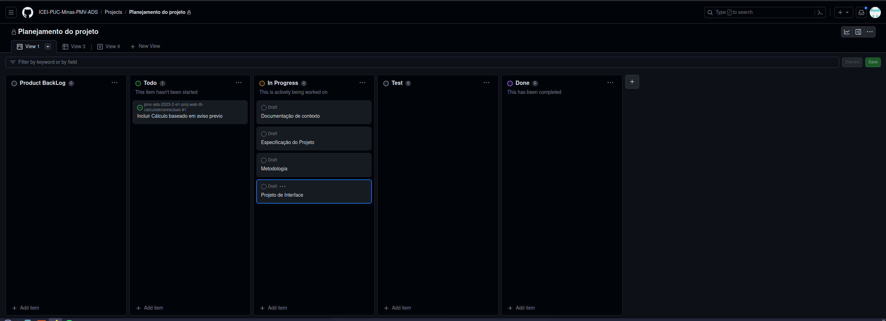

# Metodologia

## Gerenciamento de Projeto
A escolha de adotar o Scrum para o projeto se baseia na sua comprovada eficácia em promover colaboração, eficiência e controle de escopo. Dada a clareza do escopo do projeto, o Scrum se destaca como a metodologia mais apropriada. Sua habilidade em otimizar a gestão de recursos e prazos, mantendo a capacidade de resposta a mudanças inesperadas, é altamente relevante. Com suas iterações curtas, conhecidas como Sprints, e o compromisso constante em entregar valor, acreditamos que conseguiremos manter o projeto dentro do escopo estipulado, garantindo o êxito dos nossos objetivos

### Divisão de Papéis
Com base na metodologia escolhida foi definida a divisão dos papéis da seguinte forma:
- Scrum Master: Lucas Antonio Riboli
- Product Owner: Victor Ornelas da Silva
- Equipe de Desenvolvimento: Fabio Vinícius Barkoski, Gustavo Marques, Lucas Antonio Riboli, Lucas Santiago Plínio da Silva, Victor Ornelas da Silva
- Equipe de Design: Fabio Vinícius Barkoski, Gustavo Marques, Lucas Antonio Riboli, Lucas Santiago Plínio da Silva, Victor Ornelas da Silva

### Processo

- Backlog: Recebe as tarefas a serem trabalhadas e representa o Product Backlog. Todas as atividades identificadas no decorrer do projeto também devem ser incorporadas a esta coluna. 
- To Do: Esta lista representa o Sprint Backlog. Este é o Sprint atual que estamos trabalhando. 
- In Progress: Quando uma tarefa tiver sido iniciada, ela é movida para cá.
- Test: Ao ser finalizada a terefa ela pode vir a ser testada, validando assim o que foi feito.
- Done: Nesta coluna são colocadas as tarefas que passaram pelos testes e controle de qualidade e estão prontos para ser entregues ao usuário. Não há mais edições ou revisões necessárias, ele está agendado e pronto para a ação.

#### Product Backlog
Valores a serem entregues no projetos:
- Documentação de Contexto
- Especificação do Projeto
- Metodologia
- Projeto de Interface

#### Sprint 1
##### Planejamento
Para este sprint o objetivo é criar a Especificação do Projeto e a Documentação de Contexto, além de ter um esbosso de apresentação do projeto, utilizando apenas o Word e PowerPoint no Teams.
##### Execução
Separamos o grupo baseado em  cada um dos objetivos da sprint, no qual no final ficou: Fábio e Lucas Riboli em realizar a Especificação do Projeto; Victor e Lucas Silva realizarem a Documentação de Contexto; e o Gustavo em criar o esbosso de apresentação.
##### Evidências
Criado todos os documentos planejados para a sprint, todos eles se localizam no teams do grupo.

#### Sprint 2
##### Planejamento
Para este sprint o objetivo é criar a Metodologia e o Projeto de Interface. Para isso será utilizado a ferramenta [Moqup](https://moqups.com/).
##### Execução
No inicio o grupo separou os papeis do grupo, porém infelizmente a partir disto não houve grande planejamento e uma má distruibuição de tarefas. Ao final o Fábio e Lucas acabaram desempenhando um papel maior durante este sprint.
##### Evidências
Ao fim da sprint, notamos que será necessário um melhor planejamento e organização da equipe. Porém todas as tarefas foram finalizadas.

  
### Ferramentas
Os artefatos do projeto são desenvolvidos a partir de diversas plataformas e a relação dos ambientes com seu respectivo propósito é apresentada na tabela que se segue.

| AMBIENTE                            | PLATAFORMA                         |
|-------------------------------------|------------------------------------|
| Repositório de código fonte         | [GitHub](https://github.com/ICEI-PUC-Minas-PMV-ADS/pmv-ads-2023-2-e1-proj-web-t6-calculadorarescisao/tree/main/codigo-fonte) |
| Documentos do projeto               | [GitHub](https://github.com/ICEI-PUC-Minas-PMV-ADS/pmv-ads-2023-2-e1-proj-web-t6-calculadorarescisao/tree/main/documentos) |
| Gerenciamento do Projeto            | [GitHub Projects](https://github.com/orgs/ICEI-PUC-Minas-PMV-ADS/projects/618) |
| Hospedagem                          | GitHub Pages |

### Estratégia de Organização de Codificação 

Todos os artefatos relacionados a implementação e visualização dos conteúdos do projeto do site deverão ser inseridos na pasta [codigo-fonte](http://https://github.com/ICEI-PUC-Minas-PMV-ADS/WebApplicationProject-Template-v2/tree/main/codigo-fonte). Consulte também a nossa sugestão referente a estratégia de organização de codificação a ser adotada pela equipe de desenvolvimento do projeto.
