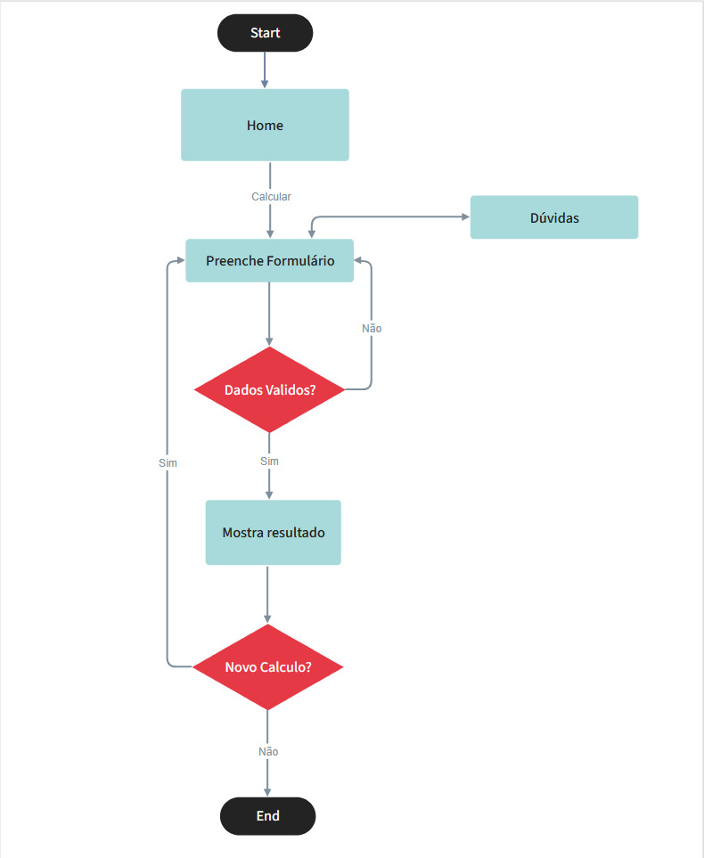
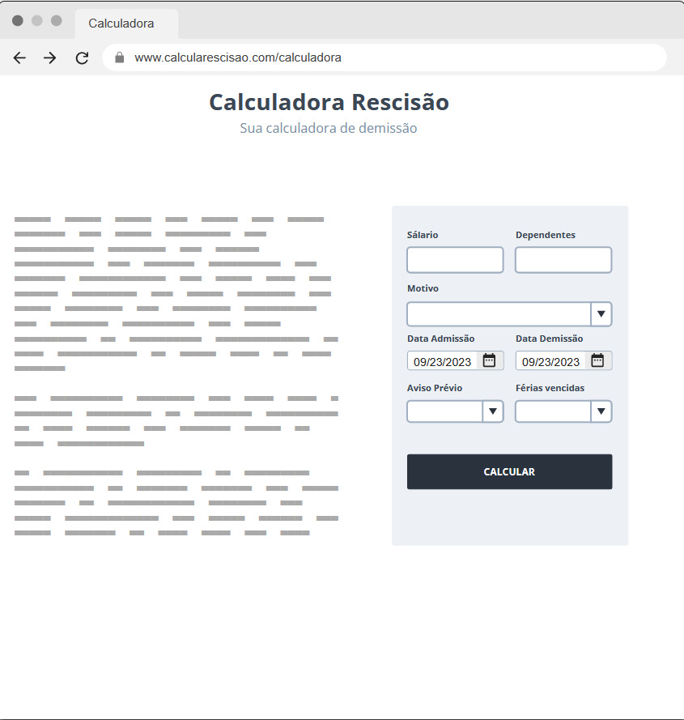
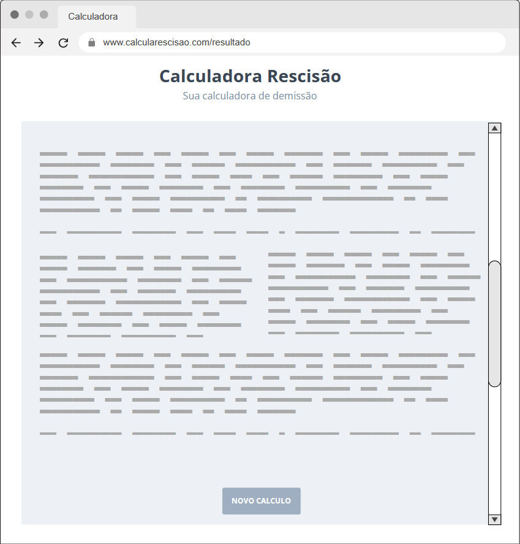

# Projeto de Interface

## User Flow

Fluxo de usuário (User Flow) é uma técnica que permite ao desenvolvedor mapear todo fluxo de navegação do usuário na aplicação. Essa técnica funciona para alinhar os caminhos e as possíveis ações que o usuário pode fazer junto com os membros de sua equipe.
|Imagem|Descrição|
|------|---------|
|| Imagem do fluxograma. |

## Protótipo

Desenvolver um protótipo emerge como uma das maneiras mais ágeis e econômicas de validar uma ideia, conceito ou funcionalidade. Isso permite a interação, avaliação, modificação e aprovação das principais características de uma interface antes de entrar na fase de desenvolvimento. Leia o artigo [Protótipos: baixa, média ou alta fidelidade?](https://medium.com/ladies-that-ux-br/prot%C3%B3tipos-baixa-m%C3%A9dia-ou-alta-fidelidade-71d897559135).

### Protótipo de baixa fidelidade

Protótipos de baixa fidelidade apresentam de forma simplificada o design da interface e o relacionamento entre suas páginas, permitindo evolução da proposta da solução. Neste projeto, os utilizaremos para apoiar a validação dos requisitos e efetuar mudanças dos mesmos, caso seja necessário, para menor impacto na codificação da aplicação.

|Imagem|Descrição|
|------|---------|
|  | Tela principal no qual será realizado o cálculo, importante notar que ao lado esquerdo(wireframe de texto) haverá informações para auxiliar o usuário durante o cálculo. |
|  | Tela no qual terá o resultado do cálculo, juntamente com a explicação do mesmo. |
