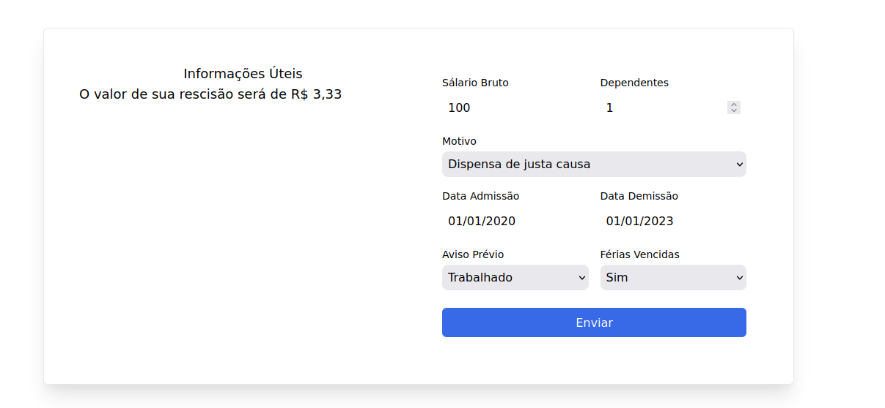
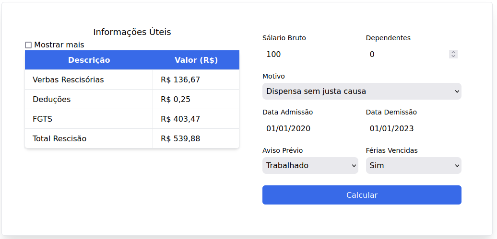
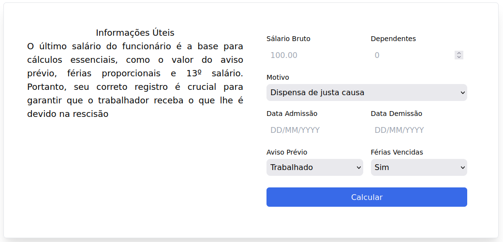

# Programação de Funcionalidades

Implementação da aplicação descritas por meio dos requisitos codificados. 

### Cálculos

#### Responsáveis

Fábio Vinícius Barkoski, Gustavo Marques Pereira, Lucas Antonio Riboli, Victor Ornelas da Silva

|Imagem|Descrição|
|------|---------|
|  | Cálculo de dispensa de justa causa |
|  | Cálculo de dispensa sem justa causa |

#### Requisito atendido

RF-01: A aplicação deverá realizar o cálculo de dispensas de justa causa.
RF-02: A aplicação deverá realizar o cálculo de dispensas sem justa causa.

#### Artefatos da funcionalidade

- index.html
- style.css
- calculus.js
- masks.js

#### Instruções de acesso

- RF-01:
    Selecione o motivo "Dispensa de justa causa" e preencha o resto dos campos conforme desejar, em seguida clique em "Calcular" e
    o resultado aparecerá ao lado, bem como será salvo no histórico de cálculos.
- RF-02:
    Selecione o motivo "Dispensa sem justa causa" e preencha o resto dos campos conforme desejar, em seguida clique em "Calcular" e
    o resultado aparecerá ao lado, bem como será salvo no histórico de cálculos.

### Explicações

#### Responsáveis

Lucas Antonio Riboli

|Imagem|Descrição|
|------|---------|
|  | Explicações de cada campo |

#### Requisito atendido

RF-13: A aplicação deve permitir que o usuário veja a explicação e os detalhes dos cálculos.

#### Artefatos da funcionalidade

- index.html
- style.css
- motion.js

#### Instruções de acesso

Selecione um campo e então aparecerá a explicação.