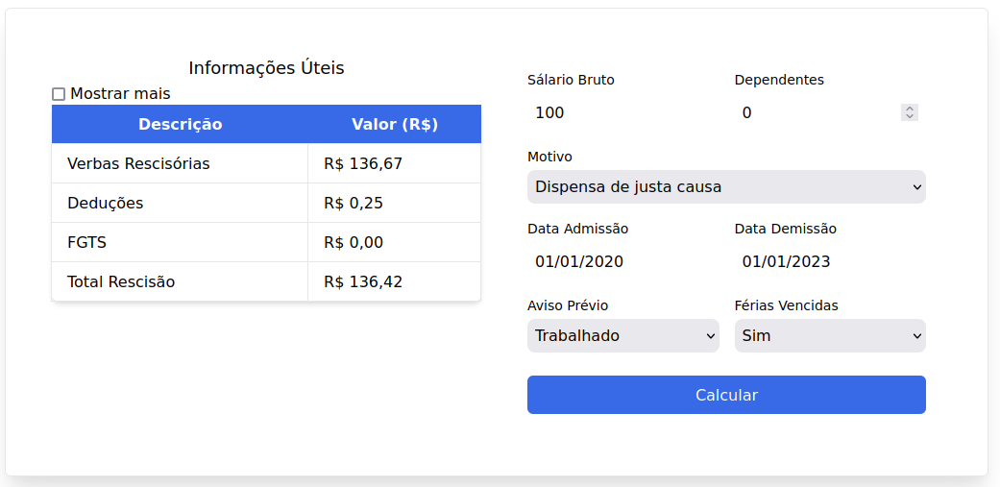

# Programação de Funcionalidades

Implementação da aplicação descritas por meio dos requisitos codificados. 

### Cálculo de dispensa de justa causa

#### Responsáveis

Fábio Vinícius Barkoski, Gustavo Marques Pereira, Lucas Antonio Riboli, Victor Ornelas da Silva

|Imagem|Descrição|
|------|---------|
|  | Captura de tela do cálculo de dispensa de justa causa |

#### Requisito atendido

RF-01: A aplicação deverá realizar o cálculo de dispensas de justa causa.

#### Artefatos da funcionalidade

- index.html
- style.css
- calculus.js
- masks.js

<!--#### Estrutura de Dados

[Caso exista estrutura de dados, adicione aqui]-->

#### Instruções de acesso

Abra um navegador de Internet e clique [aqui](https://icei-puc-minas-pmv-ads.github.io/pmv-ads-2023-2-e1-proj-web-t6-calculadorarescisao/)
para abrir a página do cálculo.

Ao abrir selecione o motivo "Dispensa de justa causa" e preencha o resto dos campos conforme desejar, em seguida clique em "Enviar" e
o resultado aparecerá ao lado, bem como será salvo no histórico de cálculos.
