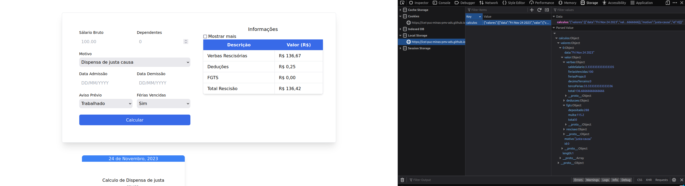

# Programação de Funcionalidades

Implementação da aplicação descritas por meio dos requisitos codificados. 

### Cálculos

#### Responsáveis

Fábio Vinícius Barkoski, Gustavo Marques Pereira, Lucas Antonio Riboli, Victor Ornelas da Silva

|Imagem|Descrição|
|------|---------|
|  | Cálculo de dispensa de justa causa |
|  | Cálculo de dispensa sem justa causa |

#### Requisito atendido

RF-01: A aplicação deverá realizar o cálculo de dispensas de justa causa. 
RF-02: A aplicação deverá realizar o cálculo de dispensas sem justa causa. 
RF-03 	A aplicação deverá realizar o cálculo de pedido de demissão. 
RF-04 	A aplicação deverá realizar o cálculo de demissão de comum acordo. 
RF-05 	A aplicação deverá realizar o cálculo de encerramento de contrato de experiência no prazo. 
RF-06 	A aplicação deverá realizar o cálculo de encerramento de contrato de experiência antes prazo. 
RF-07 	A aplicação deverá realizar o cálculo de aposentadoria do empregado. 
RF-08 	A aplicação deverá realizar o cálculo de falecimento do empregador. 
RF-09 	A aplicação deve permitir ao usuário selecionar que não cumprirá aviso prévio. 
RF-10 	A aplicação deve permitir ao usuário selecionar que cumprirá o aviso prévio. 
RF-11 	A aplicação deve permitir ao usuário selecionar que foi dispensado de cumprir aviso prévio. 
RF-12 	A aplicação deve permitir ao usuário selecionar que teve seu aviso prévio indenizado pelo empregado

#### Artefatos da funcionalidade

- index.html
- style.css
- calculus.js
- masks.js

### Estruturas de Dados

|Imagem|Descrição|
|------|---------|
|  | Estrutura de dados armazenada no Local Storage |

#### Instruções de acesso

Selecione um dos motivos disponíveis, bem como um dos avisos disponíveis e preencha o resto dos campos conforme desejar, em seguida clique em "Calcular" e
o resultado aparecerá ao lado, bem como será salvo no histórico de cálculos.

### Explicações

#### Responsáveis

Lucas Antonio Riboli

|Imagem|Descrição|
|------|---------|
|  | Explicações de cada campo |

#### Requisito atendido

RF-13: A aplicação deve permitir que o usuário veja a explicação e os detalhes dos cálculos.

#### Artefatos da funcionalidade

- index.html
- style.css
- motion.js

#### Instruções de acesso

Selecione um campo e então aparecerá a explicação.