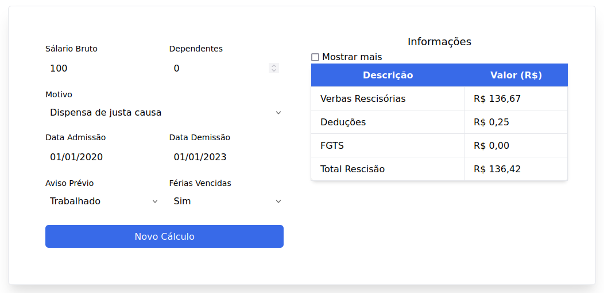
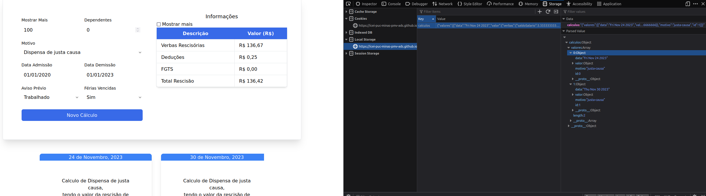
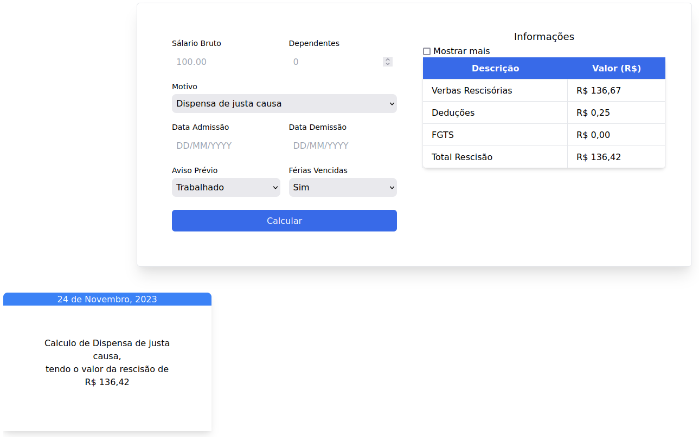
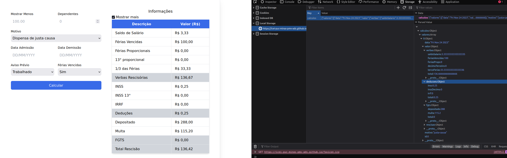

# Registro de Testes de Software

Relatório com as evidências dos testes de software realizados na aplicação pela equipe, baseado no plano de testes pré-definido.

Os resultados dos testes funcionais realizados na aplicação são descritos a seguir.

|Caso de Teste    | CT-01 - Cálculos |
|:---|:---|
| Resultados obtidos | Preenchido corretamente todos os campos do formulário, após clicado em calcular, apareceu a tabela com as informações do resultado do cálculo e criado objeto `calculos` contendo o cálculo no local storage. |
| Responsável pela execução do caso de Teste | Fábio Barkoski |

|Imagem|Descrição|
|------|---------|
|  | Resultado CT-01 |
|  | Objeto `calculos` contendo o cálculo realizado |

|Caso de Teste    | CT-02 - Histórico |
|:---|:---|
| Resultados obtidos | Clicado no card do cálculo realizado anteriormente, em seguida, apareceu a tabela com as informações do resultado do cálculo passado e consulta ao objeto `calculos` no local storage realizada com sucesso. |
| Responsável pela execução do caso de Teste | Fábio Barkoski |

|Imagem|Descrição|
|------|---------|
|  | Resultado CT-02 |
|  | Objeto `calculos` contendo o cálculo consultado |